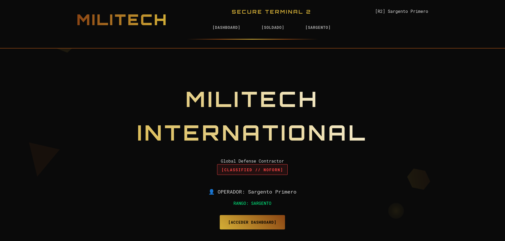
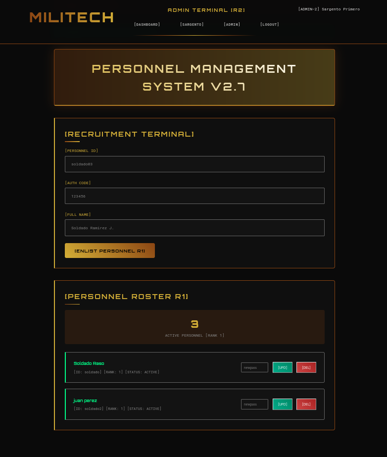
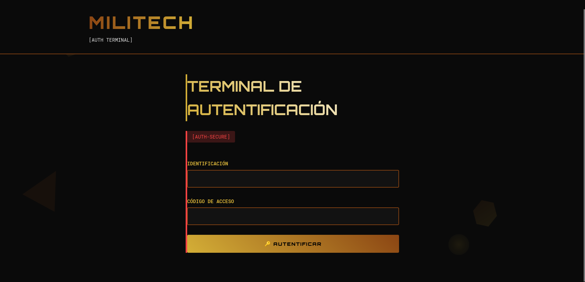

# MILITECH WEB

en este projecto he intentado aplicar lo aprendido flask, wtforms, flask-login, sqlalchemy etc

me llevo poco por que lo hice con ayuda de perplexity una ia ya que llevo 2 semanas estudiando este mundo de flask, espero que mas adelante y con practica pueda hacerlo solo , es mi primer projecto

----------
### NOTA 

- este es mi primer README

---------------------------

